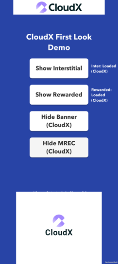
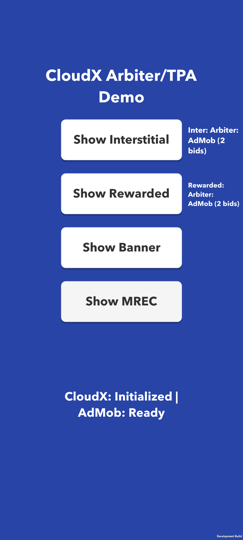
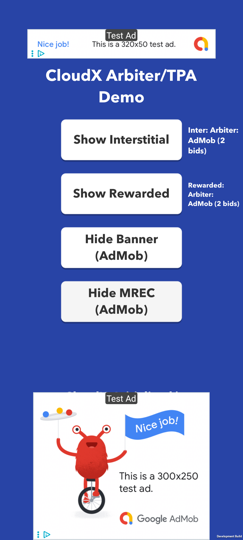

# cloudx-unity

Our complete CloudX Unity SDK integration guide is available on our docs site, [https://docs.cloudx.io/en/unity/integration](https://docs.cloudx.io/en/unity/integration).

[Click here](https://github.com/cloudx-io/cloudx-unity/releases/latest) to download the latest `.unitypackage` Github release.

## Demo app

This repository is also a runnable Unity demo project. It shows a working CloudX integration for
banner, MREC (the 300x250 medium rectangle), interstitial and rewarded ads, plus two ways of running
CloudX next to AdMob: a First Look flow that falls back to AdMob, and an Arbiter/TPA flow where both
load and Trusted Arbiter picks the winner.

Requirements:

- Unity 6 LTS `6000.0.60f1` (see `ProjectSettings/ProjectVersion.txt`)
- iOS: Xcode
- Android: the Unity Android Build Support module

Open the project in Unity and press Play, or build to a device from File > Build Settings. Build to a
device for anything beyond a smoke test: the CloudX ad callbacks are no-ops in the Editor, so ads
neither load nor show there.

### App flow

The app opens on a launch screen that picks a demo flow. Nothing SDK-related happens until you
choose, which is deliberate: the iOS tracking prompt and `CloudXSdk.Initialize` belong to the flow
you picked, not to app start.

```
OptionsScene  ──  General     ──>  GeneralScene    (the full CloudX surface)
              ├─  First Look  ──>  FirstLookScene  (CloudX first, AdMob fallback)
              └─  Arbiter/TPA ──>  ArbiterScene    (CloudX and AdMob in parallel, arbiter picks)
```

There is no back navigation; relaunch the app to pick the other flow.

| Scene | Script holding the SDK calls | What it demonstrates |
| --- | --- | --- |
| `Assets/Scenes/OptionsScene.unity` | `Assets/Scripts/OptionsScreen.cs` | Picking a flow. No SDK calls. |
| `Assets/Scenes/GeneralScene.unity` | `Assets/Scripts/GeneralScreen.cs` | Every ad format, straight CloudX. |
| `Assets/Scenes/FirstLookScene.unity` | `Assets/Scripts/FirstLook/` | CloudX first, AdMob as the fallback. |
| `Assets/Scenes/ArbiterScene.unity` | `Assets/Scripts/Arbiter/` | CloudX and AdMob in parallel, Trusted Arbiter picks. |

`Assets/Scripts/AdScreenUi.cs` is the layout shared by the three ad screens. It is demo-only: it wires
buttons and reflows on rotate, and contains no SDK calls. Ignore it when reading the integration.

### Options screen


`OptionsScene` is index 0 in the build settings, so it is what launches. Each button calls
`SceneManager.LoadScene` with a scene name, which only resolves for scenes listed in
File > Build Settings, so all four are listed there.

### General screen

The straight CloudX integration, one button per format. `GeneralScreen.cs` is the file to read: it is
the SDK call sequence and nothing else.


The screenshot has both a banner (top) and an MREC (bottom) on screen, which is why two buttons read
"Show Bottom Banner" and "Hide MREC" - the labels track what the next tap will do.

| Button | Behaviour |
| --- | --- |
| Show Interstitial | Shows the preloaded interstitial, then reloads on close. |
| Show Rewarded | Same for rewarded, and logs the reward the user earned. |
| Show/Show *edge* Banner | First tap shows the banner. Each later tap moves it to the opposite edge, so you can cycle it around the screen. |
| Show/Hide MREC | Toggles MREC visibility. |

The status line at the bottom reports initialization; the text beside each fullscreen button reports
that format's load state.

The initialization sequence, in the order `Start()` runs it:

1. **Resolve iOS tracking first.** The SDK never prompts, and treats an undetermined ATT status as
   opted out, so a load issued before ATT resolves goes out as do-not-track and never fills - even if
   the user later grants permission. On Android this step is a no-op.
2. **Set privacy and user data** (`SetHasUserConsent`, `SetDoNotSell`, user and app key/values).
   These belong before `Initialize` so they apply to the first auction.
3. **Subscribe to the initialization callbacks**, then call `CloudXSdk.Initialize`.
4. **Create and load ads only after `OnSdkInitialized`.** Buttons stay inert until then, so no tap
   can reach a `Load` before the SDK is ready.

Both initialization callbacks originate in native code, so neither is guaranteed to arrive. The demo
re-enables the UI after 15 seconds regardless, because a permanently untappable screen is a worse
failure than letting a tester poke the not-ready paths.

### First Look screen


First Look gives CloudX the first chance to fill a placement and falls back to AdMob only when CloudX
cannot. The full pattern is documented at
[https://docs.cloudx.io/en/unity/integrations/first-look](https://docs.cloudx.io/en/unity/integrations/first-look);
this screen is a working copy of it, meant to be lifted into a publisher app.

The rules the controllers implement:

- CloudX is asked first. AdMob is loaded **lazily**, only after CloudX reports a load failure.
- The two are never loaded in parallel, so the fallback costs nothing when CloudX fills.
- `Show()` prefers a ready CloudX ad over a ready AdMob one, and returns `false` when neither is
  ready. For interstitial and rewarded the caller just carries on with the game; the demo says so and
  reloads. For banner and MREC a `Show()` with nothing ready is remembered, and the ad appears as soon
  as either source loads; `Hide()` cancels that.
- If CloudX initialization fails outright, the controllers skip the CloudX leg and serve AdMob
  directly, rather than waiting for load callbacks that a failed init never delivers.
- A failed load or show is retried with a capped backoff (2 s, 4 s, 8 s ... up to 60 s), reset by the
  next successful load. A fixed short retry would turn sustained no-fill into a tight request loop
  against the fallback network.

The status text names which SDK won, so you can see the pattern working:

<p>


</p>

Left: CloudX filled. Right: the same button after CloudX no-filled, showing Google's test creative.

Everything the flow needs lives in `Assets/Scripts/FirstLook`, and none of it calls into the General
screen, so the folder can be copied out whole:

| File | Role |
| --- | --- |
| `FirstLookSource.cs` | The `CloudX` / `AdMob` enum every event reports. |
| `FirstLookAdController.cs` | Shared base: the CloudX/AdMob bookkeeping, load events, and dispose. |
| `FirstLookFullscreenController.cs` | Base for the fullscreen formats (interstitial, rewarded). |
| `FirstLookInlineController.cs` | Base for the inline formats (banner, MREC), including refresh-off. |
| `FirstLookInterstitialController.cs` | The interstitial SDK calls. |
| `FirstLookRewardedController.cs` | The rewarded SDK calls, plus the reward callback. |
| `FirstLookBannerController.cs` | The banner SDK calls. |
| `FirstLookMrecController.cs` | The MREC SDK calls. |
| `FirstLookConfig.cs` | The fallback test switch below. |
| `FirstLookScreen.cs` | Initializes both SDKs, wires the controllers to the buttons. |

Each format is a thin subclass over a shared base, so the fallback rule is written once. To integrate
one format, take four files: `FirstLookSource.cs`, `FirstLookAdController.cs`, the family base
(`FirstLookFullscreenController.cs` for interstitial or rewarded, `FirstLookInlineController.cs` for
banner or MREC) and that format's controller. The bases are small and format-agnostic.

To see the fallback path yourself, set `ForceCloudXNoFill = true` in `FirstLookConfig.cs` and rebuild.
It points CloudX at an unknown ad unit, so every CloudX load fails and AdMob serves instead. The AdMob
ad unit ids come from `Assets/Scripts/DemoConfig.cs`, next to the CloudX ones.

First Look covers all four formats. Banner and MREC toggle Show/Hide, and the button label names the
SDK that filled (e.g. `Hide Banner (CloudX)`). The banner sits at the top in both orientations; the
MREC is a 300x250 at the bottom.



Both inline ads shown at once, filled by CloudX; the labels read `Hide Banner (CloudX)` and
`Hide MREC (CloudX)`.

Banner and MREC keep auto-refresh **off** so a background reload never overrides the First Look
source decision. CloudX inline auto-refresh is opt-out - showing an inline ad starts it unless the ad
unit was first passed to `Stop*AutoRefresh` - so the controllers call `StopBannerAutoRefresh` /
`StopMrecAutoRefresh` before create and never call the `Start*` counterparts. (GeneralScreen
restarts refresh on focus; First Look deliberately does not.)

> **Disable automatic refresh on your AdMob banner and MREC ad units.**
>
> This is the one step the code cannot do for you. The Google Mobile Ads Unity plugin has no
> refresh API: a `BannerView` loads once, and whether it refreshes afterwards is decided solely by
> the ad unit's **Automatic refresh** setting in the AdMob console, in the settings of each banner
> and MREC ad unit. If that setting is on, AdMob swaps the creative on its own schedule, and
> every swap silently replaces the ad that won the First Look pass - CloudX never gets asked again
> for that slot. Set it to **Disabled** on every AdMob unit you use as a First Look fallback.
>
> The demo's Google test units are configured by Google, not by this project, so treat them only
> as a way to see the fallback render; the setting above is about the units you replace them with.

### Arbiter/TPA screen



Trusted Arbiter (TPA, third-party arbitration) is the other way to run CloudX next to an existing
mediation SDK. Where First Look asks CloudX first and touches AdMob only on a CloudX miss, the
Arbiter flow loads **both** at the same time and lets CloudX's arbiter decide which loaded ad is
shown. The full pattern is documented at
[https://docs.cloudx.io/en/unity/trusted-arbiter](https://docs.cloudx.io/en/unity/trusted-arbiter);
this screen is a working copy of it against AdMob, meant to be lifted into a publisher app.

The rules the controllers implement:

- CloudX and AdMob load in parallel. Once both have settled (loaded or failed), the loaded ones
  become bids and `CloudXSdk.Arbiter` returns the platform to show. Nothing compares prices or times
  the call out locally: the SDK owns both, and always completes. A single bid wins without a service
  call; with no arbiter service the SDK falls back to the highest locally comparable price.
- **Interstitial and rewarded prepare the winner ahead of the placement.** The arbiter runs as soon
  as the candidates settle and the result is stored; tapping Show shows the stored winner with no
  network call, and returns `false` when no winner is prepared, so the game carries on. The cycle
  restarts (reload what is missing, re-arbitrate) after the ad closes.
- **Banner and MREC arbitrate, then render.** The winner's view is shown from the arbiter callback;
  the loser stays loaded but hidden, because showing it would fire an impression for a bid the
  arbiter did not select. Auto-refresh is off on both sides and the controller drives the cycle: every
  25 seconds the shown winner (its fill was consumed by the impression) is hidden and reloaded, any
  network without a fill is re-requested, the loser keeps its fill, and a new round runs over all of
  them as soon as the loads settle. The docs reload the winner the moment its impression fires; the
  Unity plugins reload into the existing view, which replaced the visible creative within a second
  and fired an impression no round had selected, so this demo hides and reloads at the interval instead.
- **AdMob bids carry no price.** CloudX prices them from the revenue the app forwards after each AdMob
  impression: every AdMob ad's `OnAdPaid` goes into `CloudXSdk.ReportRevenueData`. This is a required
  part of the integration, not telemetry; without it CloudX never learns what AdMob pays and its
  estimate for the AdMob bid never improves.
- If CloudX initialization fails outright, the controllers skip the CloudX leg; AdMob is the only
  candidate and wins every round locally.

The status lines show the arbitration as it happens: which sides loaded, what the arbiter returned and
over how many bids (`Arbiter: CloudX (2 bids)`), and which platform is showing. Banner and MREC have no
status line of their own, so their buttons carry it: they toggle Show/Hide and the label names the
platform on screen and the bids it beat (`Hide Banner (AdMob, 2 bids)`), or reads `no winner` when a
round selected nobody.



Everything the flow needs lives in `Assets/Scripts/Arbiter`, and none of it calls into the other
screens, so the folder can be copied out whole:

| File | Role |
| --- | --- |
| `ArbiterAdController.cs` | Shared base: ids, the arbiter call, the AdMob bid, the paid-event forwarding, dispose. |
| `ArbiterFullscreenController.cs` | Base for interstitial and rewarded: parallel load, prepare the winner, show it at the placement. |
| `ArbiterInlineController.cs` | Base for banner and MREC: parallel load, arbitrate, render the winner, refresh cycle. |
| `ArbiterInterstitialController.cs` | The interstitial SDK calls. |
| `ArbiterRewardedController.cs` | The rewarded SDK calls, plus the reward callback. |
| `ArbiterBannerController.cs` | The banner SDK calls. |
| `ArbiterMrecController.cs` | The MREC SDK calls. |
| `ArbiterConfig.cs` | The refresh interval and the single-bid test switch below. |
| `ArbiterScreen.cs` | Initializes both SDKs, wires the controllers to the buttons, feeds the refresh clock. |

To integrate one format, take three files: `ArbiterAdController.cs`, the family base
(`ArbiterFullscreenController.cs` or `ArbiterInlineController.cs`) and that format's controller.
The ad unit ids come from `Assets/Scripts/DemoConfig.cs`.

To see the single-bid path yourself, set `ForceCloudXNoFill = true` in `ArbiterConfig.cs` and rebuild.
It points CloudX at an unknown ad unit, so AdMob is the only bid in every round and the SDK selects it
without a service call.

> **Two things the code cannot do for you.**
>
> Trusted Arbiter has to be enabled for your app in the CloudX dashboard. Until it is, the SDK still
> answers every `Arbiter` call, but from its local fallback: the highest locally comparable price
> among the bids, in which an AdMob bid with no reported revenue history yet cannot win.
>
> Disable **Automatic refresh** on your AdMob banner and MREC ad units, exactly as for First Look
> (see the callout above). The arbiter cycle owns refresh here; an AdMob unit that refreshes on its
> own swaps the creative behind the arbiter's back.

### Google Mobile Ads dependency

The First Look and Arbiter/TPA flows need the Google Mobile Ads Unity plugin, which this project pulls in as a
package (`Packages/manifest.json`) along with the External Dependency Manager it requires. Unity
resolves both on open, so no manual import step is needed.

If you copy the First Look or Arbiter folder into your own project, add the same plugin there; the CloudX SDK
itself does not depend on it.

### Using your own CloudX app

The demo ships with CloudX demo dashboard IDs so it runs without an account. To point it at your own
CloudX app:

1. Replace the app key and ad unit IDs in `Assets/Scripts/DemoConfig.cs`.
2. Set the bundle identifier registered for that app in Unity under
   Project Settings > Player > Identification (`ProjectSettings/ProjectSettings.asset`).

For iOS device builds also set your own Signing Team ID under
Project Settings > Player > Signing. It ships empty on purpose.

Bid requests are authorized per app key and bundle identifier, so both have to match your dashboard
app or the SDK gets no fill.

The AdMob ad units in `DemoConfig.cs` are Google's official test units and stay valid as they are;
replace them with your own AdMob units when you take this into production, and set
**Automatic refresh** to Disabled on the banner and MREC ones (see the First Look section for why).

### iOS target SDK

The project is configured for the **Simulator** SDK. To build for a physical iOS device, switch
Target SDK to Device under Project Settings > Player > Other Settings before building.
