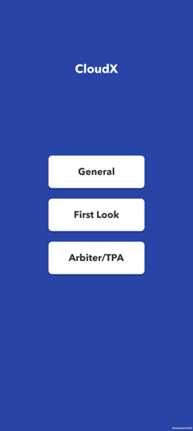
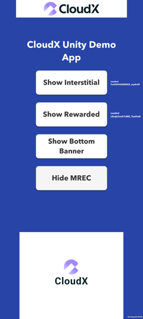
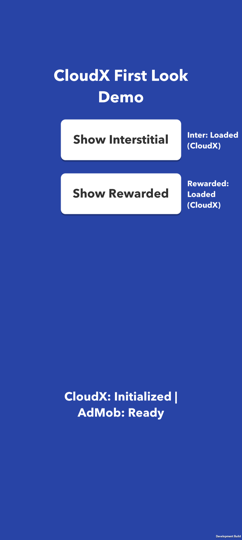
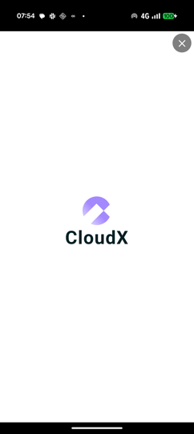
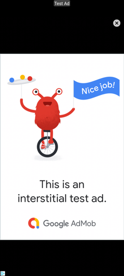

# cloudx-unity

Our complete CloudX Unity SDK integration guide is available on our docs site, [https://docs.cloudx.io/en/unity/integration](https://docs.cloudx.io/en/unity/integration).

[Click here](https://github.com/cloudx-io/cloudx-unity/releases/latest) to download the latest `.unitypackage` Github release.

## Demo app

This repository is also a runnable Unity demo project. It shows a working CloudX integration for
banner, MREC, interstitial and rewarded ads, plus a First Look flow that falls back to AdMob.

Requirements:

- Unity 6 LTS `6000.0.60f1` (see `ProjectSettings/ProjectVersion.txt`)
- iOS: Xcode
- Android: the Unity Android Build Support module

Open the project in Unity and press Play, or build to a device from File > Build Settings. Build to a
device for anything beyond a smoke test: the CloudX ad callbacks are no-ops in the Editor, so ads
neither load nor show there.

### App flow

The app opens on a launch screen that picks a demo flow. Nothing SDK-related happens until you
choose, which is deliberate: the iOS tracking prompt and `CloudXSdk.Initialize` belong to the flow
you picked, not to app start.

```
OptionsScene  ──  General    ──>  GeneralScene    (the full CloudX surface)
              └─  First Look ──>  FirstLookScene  (CloudX first, AdMob fallback)
```

There is no back navigation; relaunch the app to pick the other flow.

| Scene | Script holding the SDK calls | What it demonstrates |
| --- | --- | --- |
| `Assets/Scenes/OptionsScene.unity` | `Assets/Scripts/OptionsScreen.cs` | Picking a flow. No SDK calls. |
| `Assets/Scenes/GeneralScene.unity` | `Assets/Scripts/GeneralScreen.cs` | Every ad format, straight CloudX. |
| `Assets/Scenes/FirstLookScene.unity` | `Assets/Scripts/FirstLook/` | CloudX first, AdMob as the fallback. |

`Assets/Scripts/AdScreenUi.cs` is the layout shared by the two ad screens. It is demo-only: it wires
buttons and reflows on rotate, and contains no SDK calls. Ignore it when reading the integration.

### Options screen



`OptionsScene` is index 0 in the build settings, so it is what launches. Each button calls
`SceneManager.LoadScene` with a scene name, which only resolves for scenes listed in
File > Build Settings, so all three are listed there.

A third flow, Arbiter/TPA, is not implemented yet and its button stays hidden.

### General screen

The straight CloudX integration, one button per format. `GeneralScreen.cs` is the file to read: it is
the SDK call sequence and nothing else.



The screenshot has both a banner (top) and an MREC (bottom) on screen, which is why two buttons read
"Show Bottom Banner" and "Hide MREC" - the labels track what the next tap will do.

| Button | Behaviour |
| --- | --- |
| Show Interstitial | Shows the preloaded interstitial, then reloads on close. |
| Show Rewarded | Same for rewarded, and logs the reward the user earned. |
| Show/Show *edge* Banner | First tap shows the banner. Each later tap moves it to the opposite edge, so you can cycle it around the screen. |
| Show/Hide MREC | Toggles MREC visibility. |

The status line at the bottom reports initialization; the text beside each fullscreen button reports
that format's load state.

The initialization sequence, in the order `Start()` runs it:

1. **Resolve iOS tracking first.** The SDK never prompts, and treats an undetermined ATT status as
   opted out, so a load issued before ATT resolves goes out as do-not-track and never fills - even if
   the user later grants permission. On Android this step is a no-op.
2. **Set privacy and user data** (`SetHasUserConsent`, `SetDoNotSell`, user and app key/values).
   These belong before `Initialize` so they apply to the first auction.
3. **Subscribe to the initialization callbacks**, then call `CloudXSdk.Initialize`.
4. **Create and load ads only after `OnSdkInitialized`.** Buttons stay inert until then, so no tap
   can reach a `Load` before the SDK is ready.

Both initialization callbacks originate in native code, so neither is guaranteed to arrive. The demo
re-enables the UI after 15 seconds regardless, because a permanently untappable screen is a worse
failure than letting a tester poke the not-ready paths.

### First Look screen



First Look gives CloudX the first chance to fill a placement and falls back to AdMob only when CloudX
cannot. The full pattern is documented at
[https://docs.cloudx.io/en/unity/integrations/first-look](https://docs.cloudx.io/en/unity/integrations/first-look);
this screen is a working copy of it, meant to be lifted into a publisher app.

The rules the controllers implement:

- CloudX is asked first. AdMob is loaded **lazily**, only after CloudX reports a load failure.
- The two are never loaded in parallel, so the fallback costs nothing when CloudX fills.
- `Show()` prefers a ready CloudX ad over a ready AdMob one, and returns `false` when neither is
  ready. The caller just carries on with the game; the demo says so and reloads.
- If CloudX initialization fails outright, the controllers skip the CloudX leg and serve AdMob
  directly, rather than waiting for load callbacks that a failed init never delivers.
- A failed load or show is retried with a capped backoff (2 s, 4 s, 8 s ... up to 60 s), reset by the
  next successful load. A fixed short retry would turn sustained no-fill into a tight request loop
  against the fallback network.

The status text names which SDK won, so you can see the pattern working:

<p>


</p>

Left: CloudX filled. Right: the same button after CloudX no-filled, showing Google's test creative.

Everything the flow needs lives in `Assets/Scripts/FirstLook`, and none of it calls into the General
screen, so the folder can be copied out whole:

| File | Role |
| --- | --- |
| `FirstLookInterstitialController.cs` | The interstitial pattern: load, fallback, show, dispose. |
| `FirstLookRewardedController.cs` | The same for rewarded, plus the reward callback. |
| `FirstLookConfig.cs` | AdMob ad unit ids, and the fallback test switch below. |
| `FirstLookScreen.cs` | Initializes both SDKs, wires the controllers to the buttons. |

The two controllers are deliberately separate files with no shared base class, so integrating one
format means copying one file.

To see the fallback path yourself, set `ForceCloudXNoFill = true` in `FirstLookConfig.cs` and rebuild.
It points CloudX at an unknown ad unit, so every CloudX load fails and AdMob serves instead.

First Look currently covers interstitial and rewarded. Banner and MREC come later, and their buttons
are hidden on this screen until then - through `AdScreenUi.SetButtonVisible`, so the hide survives
rotation, which otherwise re-activates every control it reflows.

### Google Mobile Ads dependency

The First Look flow needs the Google Mobile Ads Unity plugin, which this project pulls in as a
package (`Packages/manifest.json`) along with the External Dependency Manager it requires. Unity
resolves both on open, so no manual import step is needed.

If you copy the First Look folder into your own project, add the same plugin there; the CloudX SDK
itself does not depend on it.

### Using your own CloudX app

The demo ships with CloudX demo dashboard IDs so it runs without an account. To point it at your own
CloudX app:

1. Replace the app key and ad unit IDs in `Assets/Scripts/DemoConfig.cs`.
2. Set the bundle identifier registered for that app in Unity under
   Project Settings > Player > Identification (`ProjectSettings/ProjectSettings.asset`).

For iOS device builds also set your own Signing Team ID under
Project Settings > Player > Signing. It ships empty on purpose.

Bid requests are authorized per app key and bundle identifier, so both have to match your dashboard
app or the SDK gets no fill.

The AdMob ad units in `FirstLookConfig.cs` are Google's official test units and stay valid as they
are; replace them with your own AdMob units when you take this into production.

### Test devices

Test mode is server-controlled. A device serves CloudX test ads because its advertising ID is on the
test-device list in your dashboard, not because of anything in this build — there is no code change
that turns it on.

The trap is that the advertising ID reads back as all zeros
(`00000000-0000-0000-0000-000000000000`) when the device is opted out. That is a well-formed UUID, so
it pastes into the dashboard without complaint and then matches nothing, which looks exactly like a
wrong dashboard entry rather than a consent problem. Check the device first:

| Platform | The ID zeroes when |
| --- | --- |
| iOS | App Tracking Transparency was not authorized. The demo prompts on launch; iOS only asks once per install, so a refusal needs a reinstall to undo. |
| Android | Ad personalization is off (Settings > Google > Ads > Delete advertising ID), or the app targets SDK 33+ without declaring `com.google.android.gms.permission.AD_ID`. |

### iOS target SDK

The project is configured for the **Simulator** SDK. To build for a physical iOS device, switch
Target SDK to Device under Project Settings > Player > Other Settings before building.
